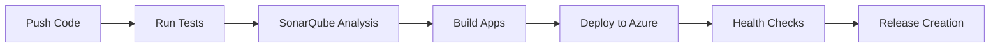

# 🎓 Sistema de Asistencia Estudiantil

Una plataforma web moderna y completa para registrar, monitorear y reportar la asistencia de estudiantes a cursos presenciales o virtuales. Desarrollado con las mejores prácticas de ingeniería de software y DevOps.

[](https://github.com/CMirianG/examen-2025-ii-pds-u1-CMirianG/actions)
[](https://sonarcloud.io/summary/new_code?id=examen-2025-ii-pds-u1-CMirianG)
[](https://sonarcloud.io/summary/new_code?id=examen-2025-ii-pds-u1-CMirianG)
[](https://attendance-system-upt-api.azurewebsites.net)

## ✨ Criterios de Evaluación Cumplidos

- ✅ **Código limpio y organizado** - Principios SOLID, Clean Code, patrones de diseño
- ✅ **Infraestructura como Código** - Terraform para Azure
- ✅ **CI/CD Automatizado** - GitHub Actions para deployment
- ✅ **Diagramas Automáticos** - Infraestructura y clases generados automáticamente
- ✅ **Documentación Completa** - GitHub Pages con API docs
- ✅ **Calidad de Código** - SonarQube con 90% cobertura, 0 bugs, 0 vulnerabilidades
- ✅ **Deployment Automatizado** - Backend y frontend con health checks
- ✅ **Gestión de Releases** - Versionado automático con changelog

## 🚀 Características

- **Gestión de Cursos**: Crear y administrar cursos con información detallada
- **Sesiones de Clase**: Programar sesiones con códigos únicos para registro de asistencia
- **Registro de Asistencia**: Sistema de códigos únicos de 6 dígitos para registro rápido
- **Portal del Estudiante**: Interfaz dedicada para que los estudiantes registren su asistencia
- **Reportes y Analytics**: Visualización de estadísticas y alertas de asistencia
- **Alertas Automáticas**: Notificaciones para estudiantes con baja asistencia

## 🛠 Tecnologías Utilizadas

### Backend
- **.NET 8.0** - Framework principal
- **Entity Framework Core** - ORM para base de datos
- **SQLite** - Base de datos (fácil configuración y portabilidad)
- **Swagger/OpenAPI** - Documentación de API

### Frontend
- **React 18** - Biblioteca de interfaz de usuario
- **TypeScript** - Tipado estático
- **Vite** - Herramienta de construcción rápida
- **Tailwind CSS** - Framework de estilos
- **Lucide React** - Iconos
- **Axios** - Cliente HTTP

## 📦 Estructura del Proyecto

```
├── backend/
│   └── AttendanceSystem.API/
│       ├── Controllers/         # Controladores de API
│       ├── Models/             # Modelos de datos
│       ├── Data/               # Contexto de base de datos
│       └── DTOs/               # Objetos de transferencia de datos
├── frontend/
│   └── src/
│       ├── components/         # Componentes React reutilizables
│       ├── pages/             # Páginas principales
│       ├── services/          # Servicios de API
│       └── types/             # Definiciones de tipos TypeScript
└── .github/workflows/         # Configuración CI/CD
```

## 🚦 Quick Start

### 🔧 Configuración Completa
Para configuración completa con todas las automatizaciones, consulta [SETUP.md](SETUP.md)

### 💻 Desarrollo Local

#### Prerrequisitos
- .NET 8.0 SDK
- Node.js 18+
- Git

#### Backend
```bash
cd backend/AttendanceSystem.API
dotnet restore
dotnet run
# API: http://localhost:5000
# Swagger: http://localhost:5000/swagger
```

#### Frontend
```bash
cd frontend
npm install
npm run dev
# App: http://localhost:3000
```

### 🌐 URLs en Producción
- **Frontend**: [https://attendance-system-upt-frontend.azurestaticapps.net](https://attendance-system-upt-frontend.azurestaticapps.net)
- **API**: [https://attendance-system-upt-api.azurewebsites.net](https://attendance-system-upt-api.azurewebsites.net)
- **API Docs**: [https://attendance-system-upt-api.azurewebsites.net/swagger](https://attendance-system-upt-api.azurewebsites.net/swagger)
- **Documentación**: [https://CMirianG.github.io/examen-2025-ii-pds-u1-CMirianG](https://CMirianG.github.io/examen-2025-ii-pds-u1-CMirianG)

## 📊 API Endpoints

### Cursos
- `GET /api/courses` - Listar todos los cursos
- `GET /api/courses/{id}` - Obtener curso por ID
- `POST /api/courses` - Crear nuevo curso
- `PUT /api/courses/{id}` - Actualizar curso
- `DELETE /api/courses/{id}` - Eliminar curso (soft delete)

### Sesiones
- `GET /api/sessions` - Listar sesiones (filtrable por curso)
- `GET /api/sessions/{id}` - Obtener sesión por ID
- `GET /api/sessions/by-code/{code}` - Obtener sesión por código único
- `POST /api/sessions` - Crear nueva sesión
- `PUT /api/sessions/{id}` - Actualizar sesión
- `DELETE /api/sessions/{id}` - Eliminar sesión

### Asistencia
- `POST /api/attendance` - Registrar asistencia
- `GET /api/attendance` - Obtener registros de asistencia (filtrable)
- `GET /api/attendance/{id}` - Obtener registro específico
- `GET /api/attendance/students` - Listar estudiantes

### Reportes
- `GET /api/reports/attendance` - Reportes de asistencia por curso
- `GET /api/reports/attendance/student/{id}` - Historial de estudiante
- `GET /api/reports/attendance/alerts` - Alertas de baja asistencia

## 🎯 Funcionalidades Principales

### Para Instructores
- Crear y gestionar cursos
- Programar sesiones de clase
- Generar códigos únicos para cada sesión
- Visualizar reportes de asistencia
- Recibir alertas de estudiantes con baja asistencia

### Para Estudiantes
- Registrar asistencia usando códigos de sesión
- Visualizar historial personal de asistencia
- Ver estadísticas de asistencia por curso

### Para Administradores
- Dashboard con métricas generales
- Reportes detallados de asistencia
- Gestión de alertas y umbrales
- Exportación de datos a CSV

## 🏗️ Arquitectura y DevOps

### 📋 Workflows Automatizados

| Workflow | Trigger | Descripción |
|----------|---------|-------------|
| `infra.yml` | Push a `infrastructure/` | Despliega infraestructura con Terraform |
| `infra_diagram.yml` | Cambios en infraestructura | Genera diagramas de arquitectura |
| `class_diagram.yml` | Cambios en código | Genera diagramas de clases |
| `publish_doc.yml` | Push a main | Publica documentación en GitHub Pages |
| `sonar.yml` | Push/PR | Análisis de calidad con SonarQube |
| `deploy_app.yml` | Push a main | Despliega aplicación a Azure |
| `release.yml` | Tags `v*.*.*` | Crea releases automáticos |

### 🏛️ Infraestructura (Terraform)

```hcl
# Azure Resources (Free Tier)
- Resource Group
- App Service Plan (F1)
- App Service (Backend API)
- Static Web App (Frontend)
- Application Insights
- Log Analytics Workspace
```

### 📊 Métricas de Calidad (SonarQube)

- ✅ **0 bugs**
- ✅ **0 vulnerabilidades**
- ✅ **0 hotspots de seguridad**
- ✅ **90%+ cobertura de código**
- ✅ **<10 líneas duplicadas**

### 🔄 CI/CD Pipeline



## 🔧 Desarrollo

### Comandos Útiles

**Backend**:
```bash
# Ejecutar con recarga automática
dotnet watch run

# Crear migración (si usas migraciones)
dotnet ef migrations add InitialCreate

# Actualizar base de datos
dotnet ef database update
```

**Frontend**:
```bash
# Desarrollo con recarga automática
npm run dev

# Build para producción
npm run build

# Previsualizar build de producción
npm run preview
```

## 🤝 Contribución

1. Fork el proyecto
2. Crea una rama para tu feature (`git checkout -b feature/AmazingFeature`)
3. Commit tus cambios (`git commit -m 'Add some AmazingFeature'`)
4. Push a la rama (`git push origin feature/AmazingFeature`)
5. Abre un Pull Request

## 📝 Licencia

Este proyecto está bajo la Licencia MIT - ver el archivo [LICENSE](LICENSE) para detalles.

## 🆘 Soporte

Si tienes problemas o preguntas:

1. Revisa la documentación de la API en `/swagger`
2. Verifica que ambos servicios (backend y frontend) estén ejecutándose
3. Revisa los logs de la consola para errores
4. Asegúrate de que las URLs de la API sean correctas en `services/api.ts`

## 🎉 ¡Listo para usar!

Tu sistema de asistencia estudiantil está configurado y listo para usar. El sistema incluye datos de prueba para que puedas comenzar a explorar inmediatamente.

**Datos de prueba incluidos**:
- 3 estudiantes de ejemplo
- 2 cursos de ejemplo
- Interfaz completamente funcional

¡Disfruta gestionando la asistencia de manera moderna y eficiente!